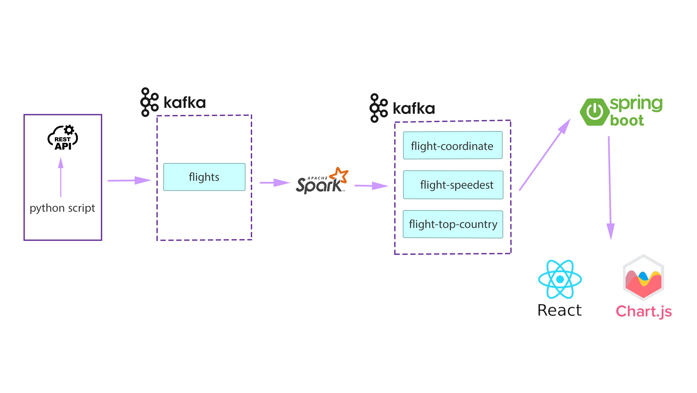

# Flight Data Analysis with Big Data

This repository contains the codebase for a Big Data project focused on flight data analysis. The architecture of the project is illustrated above.

## Project Structure

- **SparkClient**: This folder contains the Spark Scala project, which handles real-time data processing and analysis of flight data.

- **SparkFlights**: In this folder, you'll find the Spring Boot application responsible for consuming processed flight data and exposing REST APIs for consumption by the React app.

- **VisualReactApp**: The React app folder contains the user interface for visualizing flight data insights. It consumes data from the Spring Boot app's APIs and uses Mapbox for geospatial visualization.

## Getting Started

To run each component of the project, follow the instructions in their respective folders:

- **SparkScalaProject**: Refer to the [README](SparkFlights/README.md) in the SparkScalaProject folder for setup and usage instructions.

- **SpringBootApp**: Refer to the [README](SparkClient/README.md) in the SpringBootApp folder for setup and usage instructions.

- **ReactApp**: Refer to the [README](VisualReactApp/README.md) in the ReactApp folder for setup and usage instructions.

## License

This project is licensed under the MIT License - see the [LICENSE](LICENSE) file for details.

## Acknowledgments

This project was developed as part of the Master's program in Distributed Computing Systems and Big Data at Ibn Zohr University.

